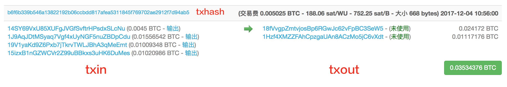

交易（1）
========

## 引言

交易（transaction）是比特币的核心所在，而区块链唯一的目的，也正是为了能够安全可靠地存储交易。在区块链中，交易一旦被创建，就没有任何人能够再去修改或是删除它。今天，我们将会开始实现交易。不过，由于交易是很大的话题，我会把它分为两部分来讲：在今天这个部分，我们会实现交易的基本框架。在第二部分，我们会继续讨论它的一些细节。

## 没有勺子

如果以前开发过 web 应用，在支付的实现环节，你可能会在数据库中创建这样两张表：

- **accounts**
- **transactions**

account（账户）会存储用户信息，里面包括了个人信息和余额。transaction（交易）会存储资金转移信息，也就是资金从一个账户转移到另一个账户这样的内容。在比特币中，支付是另外一种完全不同的方式：

1. 没有账户（account）
2. 没有余额（balance）
3. 没有住址（address）
4. 没有货币（coin）
5. 没有发送人和接收人（sender，receiver）（这里所说的发送人和接收人，是基于现实生活中的场景，在日常生活中交易双方与人是一一对应的。而在比特币中，“交易双方”是地址，地址背后才是人，人与地址并不是一一对应的关系，一个人可能有很多个地址。）

鉴于区块链是一个公开开放的数据库，所以我们并不想要存储钱包所有者的敏感信息（所以它具有一定的匿名性）。资金不是通过账户来收集，交易也不是从一个地址将钱转移到另一个地址，也没有一个字段或者属性来保存账户余额。交易就是区块链要表达的所有内容。那么，交易里面到底有什么内容呢？

## 比特币交易

一笔交易由一些输入（input）和输出（output）组合而来：



点击 [这里](https://blockchain.info/zh-cn/tx/b6f6b339b546a13822192b06ccbdd817afea5311845f769702ae2912f7d94ab5) 在 blockchain.info 查看上图中的交易信息。

```go
type Transaction struct {
	ID   []byte
	Vin  []TXInput
	Vout []TXOutput
}
```

对于每一笔新的交易，它的输入会引用（reference）之前一笔交易的输出（这里有个例外，也就是我们待会儿要谈到的 coinbase 交易），引用就是花费的意思。所谓引用之前的一个输出，也就是将之前的一个输出包含在另一笔交易的输入当中，就是花费之前的交易输出。交易的输出，就是币实际存储的地方。下面的图示阐释了交易之间的互相关联：


注意：

1. 有一些输出并没有被关联到某个输入上
2. 一笔交易的输入可以引用之前多笔交易的输出
3. 一个输入必须引用一个输出

贯穿本文，我们将会使用像“钱（money）”，“币（coin）”，“花费（spend）”，“发送（send）”，“账户（account）” 等等这样的词。但是在比特币中，其实并不存在这样的概念。交易仅仅是通过一个脚本（script）来锁定（lock）一些价值（value），而这些价值只可以被锁定它们的人解锁（unlock）。

----

- 下一节: [交易输入](txin.md)
