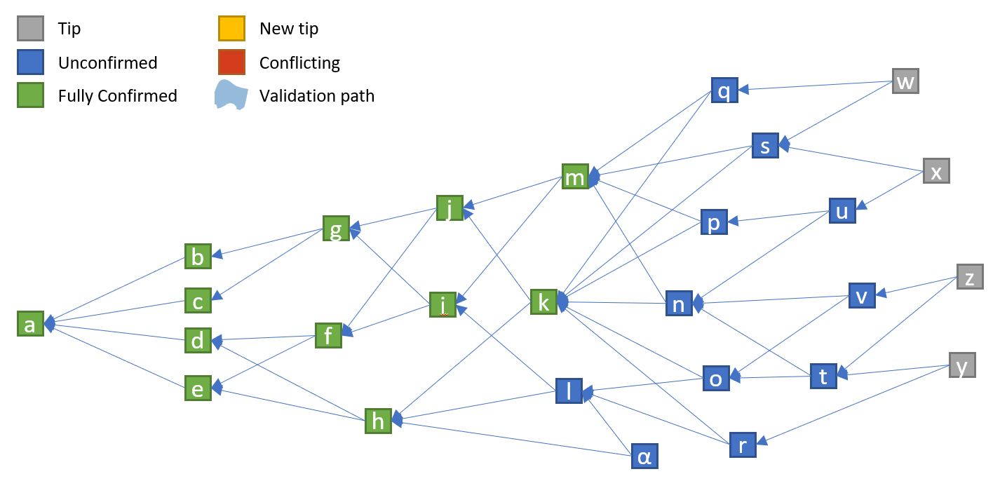
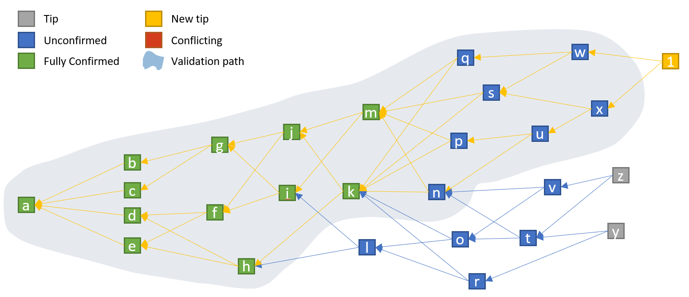
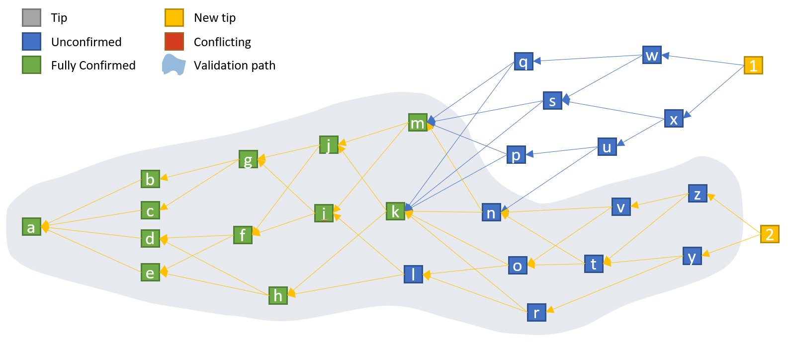
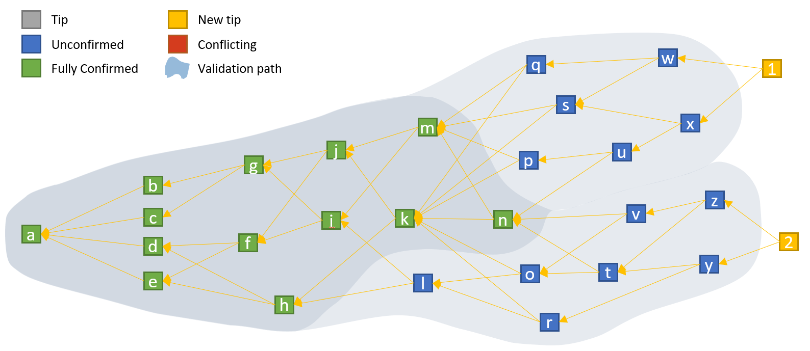
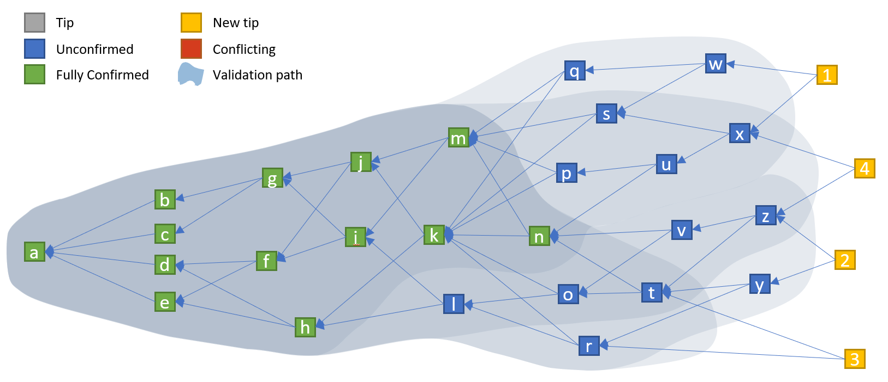
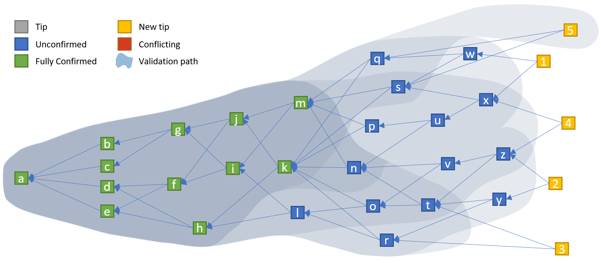
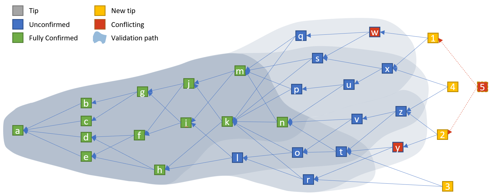
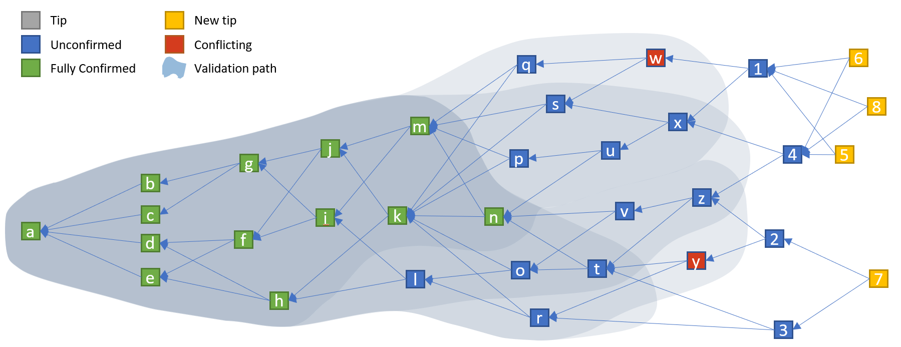
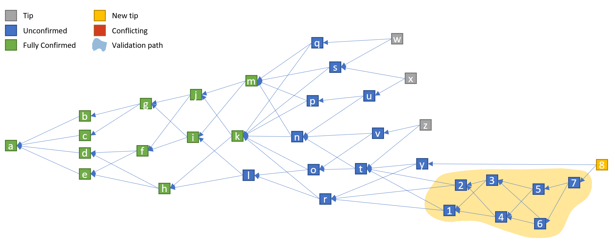

IOTA 交易，确认和共识
====================

>原文：https://github.com/noneymous/iota-consensus-presentation

## Tangle 初始状态

与区块链技术不同，IOTA 并不是一条有着时间序列概念，每个区块前后相连的链，链中的每个块包含一些交易。在 IOTA 中，每笔交易都可以其他交易连接（所谓连接，就是验证其他交易），并且可并行发生。下面的内容将就如何在 IOTA 中加入交易，验证交易及其共识机制展开。

上图是 tangle 的一个案例，下面内容都会围绕该图展开。绿色交易代表已经被网络以高确定性（high certainty）地确认，蓝色交易是部分确认，也就是确定性较低。灰色（以及下面的黄色）方框表示还没有任何人验证过的 tip （*tip 有尖端，尾部的意思，比如手指尖就可以用这个词，这里的 tip 表示 tangle 中最新的尚无人验证的交易*）。红色交易，表示有冲突，或无效交易。

在上图中，交易 `α` 并非一笔普通交易。它引用了交易 `h` 和 `l`，由于交易 `h` 已经被交易 `l` 引用了， `α` 会选择一个 tip(`l`) 和 一个显然不是 tip 的交易（`h`）。这么做目前似乎并没有问题，网络也允许这样的行为。

## 加入一笔交易

为了向 tangle 中加入一笔新的交易，用户必须从 tangle 中随机挑选出两个 tip（tip 就是尚未确认的交易），并对两个 tip 进行验证。所谓验证，意味着用户需要检查 tip 的签名，即所谓的 PoW，并确保所选的 tip 与之前的任何交易（无论是直接相关还是间接相关）都没有冲突。如果所选的 tip 是合法的，用户就对其进行引用，也就是加入新的交易。

如果交易既没有被所选的 tip 直接引用，也没有被间接引用，那么对于当前的验证过程来说，这些交易就是不相关的交易。对于不相关交易，会由其他人或是之后的交易来进行验证，并将它们加入到 tangle 中。

## 另一笔交易

与此同时（其实不必同时，早一点晚一点都无所谓），另一个用户可能正在一个不同的位置加入新的交易。它选择了 tip `z` 和 `y`。如此一来，它就在更大的范围上验证了已经验证过的同样交易，即 `a` 到 `k`，`m` 到 `n`，加上额外的一些没有在交易 `1` 验证路径上的交易（`l`, `o`, `r`, `t`, `v`, `y` 和 `z`）。

## 新的 Tangle 状态

交易 `1` 和 `2` 的验证路径有重合之处，我们可以看到有一些交易仅被确认一次，有些交易被确认两次。被当前所有 tip 验证和确认的交易就被认为是完全确认。因此，交易 `n` 进入 tangle 更深一层，现在变成了绿色。从现在开始，随后所有连接到 `1` 与/或 `2` 或者它的孩子，将会保持再验证和再确认的交易状态。

我们已经学到了什么？

- 没有人需要看到和验证所有的交易。每个用户仅需要选择和验证两笔交易及其父交易。如此一来，他们仅验证了 tangle 的一部分而已。当其他用户选择并验证不同的 tip 和路径，完整 tangle 的协同验证就出现了。

- 在某个时间点以后，一旦一笔交易在 tangle 中进入足够深的位置，无论从最新的 tip 中的任意一个，无论从直接或是间接路径上它都存在。这样的交易就被认为是完全确认，并且会被每一个新的交易再验证，再确认。我们可以认为它被所有用户（和机器）确认，并且确定性很高。

- 为了对确认进行检查，接收者只需要检查交易是否被已有的所有 tip 直接或间接引用（或者通过一个确定比率，如果确定性更低的话，比如 80%，也可以接受）。这时候就不需要再验证或是其他类似操作了。注意：可能会有上千个 tip。与其检查每个 tip 的父节点，更可能的是选择一个随机样本，并做一个统计评估。

注意交易 `n` 还没有被确认，因为现在我们的 tip 比较少。下面会展示更多 tip 的场景。

## 确认级别

我加入了一些新的 tip 对上例进行了扩展。对于每个新的 tip，它的验证路径都被高亮了。通过颜色，你可以清楚地看到哪些交易被多少 tip 所验证，及其验证等级。

一个商家可能会根据自身情况设定个性化的确认/确定等级。如果交易速度比交易价值更重要（比如微支付或零价值支付），又或者发送方是一个朋友，一个人可能会以 75% 的确认等级接受交易。在 75% 的确定等级（3/4 tip）下，交易 `l`, `o`, 和 `t` 可能也会被确认。

## 传播延迟

理论上，由于更慢的 PoW 或者传播延迟，可能在稍后出现一笔慢速交易 `5`。鉴于我们已经知道了交易 `5`，交易 `n` 就不会再被所有的 tip 完全确认。但是，他们的确认确定性（confirmation certainty）仍然很高，有 4/5 tip 确认（实际上会有上千而不是 5 个 tip）。记住，所有一切都是为了一个高概率的确定性 -- 就像在区块链里面，区块的每次确认就是增加了确定性的概率。

请注意，本例中的交易 `5` 的状态并非从 “确认” 转变为 “未确认”。它仅是从改变了数学上精确的确定性比率（比如，如果一共有 100 个 tip，从 100% 到 99%）。一旦一些随后的交易引用了交易 `1` 和 `5`，交易 `n` 就会被所有的 tip 再次完全确认。这样小的确认等级变化将不太可能会发生，更进一步的交易会进入 tangle。 

请注意，100% 的确认/确定等级无论如何都很难达到，因为总会出现一些无正面贡献的 tip（比如，引用一些无用的交易，或是根本不遵守协议）。

## 双花

想象这样一种情况，一个用户在 tangle 的两个不同的地方加入了两笔冲突的交易（`w` 和 `y`）。对于随后的用户，在他们的验证路径上可能只有这些冲突交易里面的其中一笔（取决于他们的 tip 选择，和一些可能的传播时延）。比如，加入了交易 `1` 和 `2` 的用户就不会看到冲突，并会确认他们所选的 tip。因此，双花就得到了第一次确认。但是，迟早必然会发生的是，这两笔冲突的交易会出现在一笔交易的验证路径上。比如，交易 5 就会看到冲突，继而不会确认选出的 tip。相反，为了确保它自身会是一笔有效的交易，它会重新选择 tip 直到找到不冲突的交易。

依赖于 tip 的选择和 tangle 的推进，在冲突变得逐渐清晰之前，可能会有更多的用户在 `w` 或 `y` 后面附加交易。取决于用户在哪里附加最多新的交易，`w` 或者 `y` 都会在某个点确认，但是其他会被丢弃。被丢弃交易（因为它们看不到即将到来的冲突）后面的所有交易也会被丢弃。但是，这些交易并不会丢失，而是可能被任何人（但最可能是交易接收方）接受，并为了新的确认机会再次附加到 tangle。这时，PoW 就需要重新来过，但是并不需要从发送方发送新的签名了。

## 解决双花

上面已经说到，一个用户尝试将交易 `5` 与 tip `1` 和 `2` 相连。由于冲突，它重新进行选择 tip，并且决定连接到 tip `1` 和 `4`。另一个用户（也可能是同一个）选择 tip `2` 和 `3` 连接到交易 7。虽然出现了多个分支，但是由于 `w` 和 `y `的双花，只有一个能够存活。基于 tip 的随机选择（和交易的累积权重），这两个分支的其中一个会接收更多的的子交易（独立的，权重）直到 tangle 进入一个状态，在这个状态里就不可能再合法地附加任一片段。在上面的示例中，用户可能继续与交易 `5`，`6` 和 `8` 相连，但是不会连接到交易 `7`。因此，交易 `y`，`2`，`3` 和 `7` 将永远也不会成为一个完全确认的状态。

正如上面所说的，交易 `y`，`2`，`3` 和 `7` 可能被再次加入 tangle 。只要他们（仍然）是有效的，就会新的机会被确认。交易 `2`，`3` 和 `7` 可能然后被确认，但是交易 `y` 仍然无效。

## 离线 Tangle

tangle 能够让用户在离线的情况下，仍然能够继续构建交易，比如在公司内部的局域网，或者在断电的情况下与邻居继续交互。如此，依照协议规定创建交易，并相互连接。

在上面的案例中，交易 `1` 和 `2` 是首先离线的一批。它们与在线 tangle（online tangle） 最后已知的 tip 相连。随后的交易与往常一样不断地附加到后面。一旦有向主 tangle（main tangle） 的提交（commit），离线的子 tangle 就会通过创建交易 `8` 得到最终确定，它会将离线 tangle 与当前在线 tangle 的 tip 进行合并。随后，交易 `8` 变为一个合法的 tip，并且可供后面的在线交易进行选择和验证。在线连接到交易 `8` 的下一个用户，将会在他们的验证路径上包含所有的离线交易。

请注意，正如上文，只有当离线交易跟其他交易一样，被加入到主 tangle 中，离线交易才会被完全确认。如果离线分支中的任何交易与主 tangle 冲突，交易 `1` 到 `8` 就不会被确认。再一次的，它可能会花费随后几个交易的时间，直至冲突对于主 tangle 的所有（或者大部分） tip 都可见（也就是上面所说的 “双花”）。
