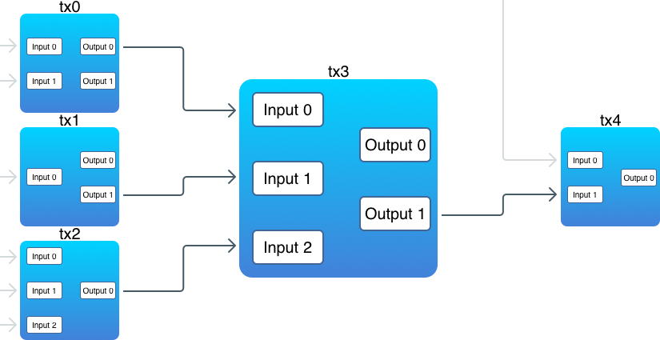

交易（1）
========

## 引言

交易（transaction）是比特币的核心所在，而区块链唯一的目的，也正是为了能够安全可靠地存储交易。在区块链中，交易一旦被创建，就没有任何人能够再去修改或是删除它。今天，我们将会开始实现交易。不过，由于交易是很大的话题，我会把它分为两部分来讲：在今天这个部分，我们会实现交易的基本框架。在第二部分，我们会继续讨论它的一些细节。

由于比特币采用的是 UTXO 模型，并非账户模型，并不直接存在“余额”这个概念，余额需要通过遍历整个交易历史得来。

## 比特币交易

点击 [这里](https://blockchain.info/zh-cn/tx/b6f6b339b546a13822192b06ccbdd817afea5311845f769702ae2912f7d94ab5) 在 blockchain.info 查看下图中的交易信息。


一笔交易由一些输入（input）和输出（output）组合而来：

```go
type Transaction struct {
	ID   []byte
	Vin  []TXInput
	Vout []TXOutput
}
```

对于每一笔新的交易，它的输入会引用（reference）之前一笔交易的输出（这里有个例外，coinbase 交易），引用就是花费的意思。所谓引用之前的一个输出，也就是将之前的一个输出包含在另一笔交易的输入当中，就是花费之前的交易输出。交易的输出，就是币实际存储的地方。下面的图示阐释了交易之间的互相关联：



注意：

1. 有一些输出并没有被关联到某个输入上
2. 一笔交易的输入可以引用之前多笔交易的输出
3. 一个输入必须引用一个输出

贯穿本文，我们将会使用像“钱（money）”，“币（coin）”，“花费（spend）”，“发送（send）”，“账户（account）” 等等这样的词。但是在比特币中，其实并不存在这样的概念。交易仅仅是通过一个脚本（script）来锁定（lock）一些值（value），而这些值只可以被锁定它们的人解锁（unlock）。

每一笔比特币交易都会创造输出，输出都会被区块链记录下来。给某个人发送比特币，实际上意味着创造新的 UTXO 并注册到那个人的地址，可以为他所用。

## 交易输出

先从输出（output）开始：

```go
type TXOutput struct {
	Value        int
	ScriptPubKey string
}
```

输出主要包含两部分：

1. 一定量的比特币(`Value`)
2. 一个锁定脚本(`ScriptPubKey`)，要花这笔钱，必须要解锁该脚本。

实际上，正是输出里面存储了“币”（注意，也就是上面的 `Value` 字段）。而这里的存储，指的是用一个数学难题对输出进行锁定，这个难题被存储在 `ScriptPubKey` 里面。在内部，比特币使用了一个叫做 *Script* 的脚本语言，用它来定义锁定和解锁输出的逻辑。虽然这个语言相当的原始（这是为了避免潜在的黑客攻击和滥用而有意为之），并不复杂，但是我们也并不会在这里讨论它的细节。你可以在[这里](https://en.bitcoin.it/wiki/Script) 找到详细解释。

>在比特币中，`value` 字段存储的是 *satoshi* 的数量，而不是 BTC 的数量。一个 *satoshi* 等于一亿分之一的 BTC(0.00000001 BTC)，这也是比特币里面最小的货币单位（就像是 1 分的硬币）。

由于还没有实现地址（address），所以目前我们会避免涉及逻辑相关的完整脚本。`ScriptPubKey` 将会存储一个任意的字符串（用户定义的钱包地址）。

>顺便说一下，有了一个这样的脚本语言，也意味着比特币其实也可以作为一个智能合约平台。

关于输出，非常重要的一点是：它们是**不可再分的（indivisible）**。也就是说，你无法仅引用它的其中某一部分。要么不用，如果要用，必须一次性用完。当一个新的交易中引用了某个输出，那么这个输出必须被全部花费。如果它的值比需要的值大，那么就会产生一个找零，找零会返还给发送方。这跟现实世界的场景十分类似，当你想要支付的时候，如果一个东西值 1 美元，而你给了一个 5 美元的纸币，那么你会得到一个 4 美元的找零。

## 发送币

现在，我们想要给其他人发送一些币。为此，我们需要创建一笔新的交易，将它放到一个块里，然后挖出这个块。之前我们只实现了 coinbase 交易（这是一种特殊的交易），现在我们需要一种通用的普通交易：

```go
func NewUTXOTransaction(from, to string, amount int, bc *Blockchain) *Transaction {
	var inputs []TXInput
	var outputs []TXOutput

	acc, validOutputs := bc.FindSpendableOutputs(from, amount)

	if acc < amount {
		log.Panic("ERROR: Not enough funds")
	}

	// Build a list of inputs
	for txid, outs := range validOutputs {
		txID, err := hex.DecodeString(txid)

		for _, out := range outs {
			input := TXInput{txID, out, from}
			inputs = append(inputs, input)
		}
	}

	// Build a list of outputs
	outputs = append(outputs, TXOutput{amount, to})
	if acc > amount {
		outputs = append(outputs, TXOutput{acc - amount, from}) // a change
	}

	tx := Transaction{nil, inputs, outputs}
	tx.SetID()

	return &tx
}
```

在创建新的输出前，我们首先必须找到所有的未花费输出，并且确保它们有足够的价值（value），这就是 `FindSpendableOutputs` 方法要做的事情。随后，对于每个找到的输出，会创建一个引用该输出的输入。接下来，我们创建两个输出：

1. 一个由接收者地址锁定。这是给其他地址实际转移的币。

2. 一个由发送者地址锁定。这是一个找零。只有当未花费输出超过新交易所需时产生。记住：输出是**不可再分的**。

`FindSpendableOutputs` 方法基于之前定义的 `FindUnspentTransactions` 方法：

```go
func (bc *Blockchain) FindSpendableOutputs(address string, amount int) (int, map[string][]int) {
	unspentOutputs := make(map[string][]int)
	unspentTXs := bc.FindUnspentTransactions(address)
	accumulated := 0

Work:
	for _, tx := range unspentTXs {
		txID := hex.EncodeToString(tx.ID)

		for outIdx, out := range tx.Vout {
			if out.CanBeUnlockedWith(address) && accumulated < amount {
				accumulated += out.Value
				unspentOutputs[txID] = append(unspentOutputs[txID], outIdx)

				if accumulated >= amount {
					break Work
				}
			}
		}
	}

	return accumulated, unspentOutputs
}
```

这个方法对所有的未花费交易进行迭代，并对它的值进行累加。当累加值大于或等于我们想要传送的值时，它就会停止并返回累加值，同时返回的还有通过交易 ID 进行分组的输出索引。我们只需取出足够支付的钱就够了。

现在，我们可以修改 `Blockchain.MineBlock` 方法：

```go
func (bc *Blockchain) MineBlock(transactions []*Transaction) {
	...
	newBlock := NewBlock(transactions, lastHash)
	...
}
```

最后，让我们来实现 `send` 方法：

```go
func (cli *CLI) send(from, to string, amount int) {
	bc := NewBlockchain(from)
	defer bc.db.Close()

	tx := NewUTXOTransaction(from, to, amount, bc)
	bc.MineBlock([]*Transaction{tx})
	fmt.Println("Success!")
}
```

发送币意味着创建新的交易，并通过挖出新块的方式将交易打包到区块链中。不过，比特币并不是一连串立刻完成这些事情（虽然我们目前的实现是这么做的）。相反，它会将所有新的交易放到一个内存池中（mempool），然后当矿工准备挖出一个新块时，它就从内存池中取出所有交易，创建一个候选块。只有当包含这些交易的块被挖出来，并添加到区块链以后，里面的交易才开始确认。

让我们来检查一下发送币是否能工作：

```bash
$ blockchain_go send -from Ivan -to Pedro -amount 6
00000001b56d60f86f72ab2a59fadb197d767b97d4873732be505e0a65cc1e37

Success!

$ blockchain_go getbalance -address Ivan
Balance of 'Ivan': 4

$ blockchain_go getbalance -address Pedro
Balance of 'Pedro': 6
```

很好！现在，让我们创建更多的交易，确保从多个输出中发送币也正常工作：

```bash
$ blockchain_go send -from Pedro -to Helen -amount 2
00000099938725eb2c7730844b3cd40209d46bce2c2af9d87c2b7611fe9d5bdf

Success!

$ blockchain_go send -from Ivan -to Helen -amount 2
000000a2edf94334b1d94f98d22d7e4c973261660397dc7340464f7959a7a9aa

Success!
```

现在，Helen 的币被锁定在了两个输出中：一个来自 Pedro，一个来自 Ivan。让我们把它们发送给其他人：

```bash
$ blockchain_go send -from Helen -to Rachel -amount 3
000000c58136cffa669e767b8f881d16e2ede3974d71df43058baaf8c069f1a0

Success!

$ blockchain_go getbalance -address Ivan
Balance of 'Ivan': 2

$ blockchain_go getbalance -address Pedro
Balance of 'Pedro': 4

$ blockchain_go getbalance -address Helen
Balance of 'Helen': 1

$ blockchain_go getbalance -address Rachel
Balance of 'Rachel': 3
```

看起来没问题！现在，来测试一些失败的情况：

```bash
$ blockchain_go send -from Pedro -to Ivan -amount 5
panic: ERROR: Not enough funds

$ blockchain_go getbalance -address Pedro
Balance of 'Pedro': 4

$ blockchain_go getbalance -address Ivan
Balance of 'Ivan': 2
```

## 总结

虽然不容易，但是现在终于实现交易了！不过，我们依然缺少了一些像比特币那样的一些关键特性：

1. 地址（address）。我们还没有基于私钥（private key）的真实地址。

2. 奖励（reward）。现在挖矿是肯定无法盈利的！

3. UTXO 集。获取余额需要扫描整个区块链，而当区块非常多的时候，这么做就会花费很长时间。并且，如果我们想要验证后续交易，也需要花费很长时间。而 UTXO 集就是为了解决这些问题，加快交易相关的操作。

4. 内存池（mempool）。在交易被打包到块之前，这些交易被存储在内存池里面。在我们目前的实现中，一个块仅仅包含一笔交易，这是相当低效的。


## 交易输入

这里是输入：

```go
type TXInput struct {
	Txid      []byte
	Vout      int
	ScriptSig string
}
```

正如之前所提到的，一个输入引用了之前交易的一个输出：`Txid` 存储的是之前交易的 ID，`Vout` 存储的是该输出在那笔交易中所有输出的索引（因为一笔交易可能有多个输出，需要有信息指明是具体的哪一个）。`ScriptSig` 是一个脚本，提供了可解锁输出结构里面 `ScriptPubKey` 字段的数据。如果 `ScriptSig` 提供的数据是正确的，那么输出就会被解锁，然后被解锁的值就可以被用于产生新的输出；如果数据不正确，输出就无法被引用在输入中，或者说，无法使用这个输出。这种机制，保证了用户无法花费属于其他人的币。

再次强调，由于我们还没有实现地址，所以目前 `ScriptSig` 将仅仅存储一个用户自定义的任意钱包地址。我们会在下一篇文章中实现公钥（public key）和签名（signature）。

来简要总结一下。输出，就是 “币” 存储的地方。每个输出都会带有一个解锁脚本，这个脚本定义了解锁该输出的逻辑。每笔新的交易，必须至少有一个输入和输出。一个输入引用了之前一笔交易的输出，并提供了解锁数据（也就是 `ScriptSig` 字段），该数据会被用在输出的解锁脚本中解锁输出，解锁完成后即可使用它的值去产生新的输出。

每一笔输入都是之前一笔交易的输出，那么假设从某一笔交易开始不断往前追溯，它所涉及的输入和输出到底是谁先存在呢？换个说法，这是个鸡和蛋谁先谁后的问题，是先有蛋还是先有鸡呢？

## 先有蛋

在比特币中，是先有蛋，然后才有鸡。输入引用输出的逻辑，是经典的“蛋还是鸡”问题：输入先产生输出，然后输出使得输入成为可能。在比特币中，最先有输出，然后才有输入。换而言之，第一笔交易只有输出，没有输入。

当矿工挖出一个新的块时，它会向新的块中添加一个 **coinbase** 交易。coinbase 交易是一种特殊的交易，它不需要引用之前一笔交易的输出。它“凭空”产生了币（也就是产生了新币），这是矿工获得挖出新块的奖励，也可以理解为“发行新币”。

在区块链的最初，也就是第一个块，叫做创世块。正是这个创世块，产生了区块链最开始的输出。对于创世块，不需要引用之前的交易输出。因为在创世块之前根本不存在交易，也就没有不存在交易输出。

来创建一个 coinbase 交易：

```go
func NewCoinbaseTX(to, data string) *Transaction {
	if data == "" {
		data = fmt.Sprintf("Reward to '%s'", to)
	}

	txin := TXInput{[]byte{}, -1, data}
	txout := TXOutput{subsidy, to}
	tx := Transaction{nil, []TXInput{txin}, []TXOutput{txout}}
	tx.SetID()

	return &tx
}
```

coinbase 交易只有一个输出，没有输入。在我们的实现中，它表现为 `Txid` 为空，`Vout` 等于 -1。并且，在当前实现中，coinbase 交易也没有在 `ScriptSig` 中存储脚本，而只是存储了一个任意的字符串 `data`。

>在比特币中，第一笔 coinbase 交易包含了如下信息：“The Times 03/Jan/2009 Chancellor on brink of second bailout for banks”。[可点击这里查看](https://blockchain.info/tx/4a5e1e4baab89f3a32518a88c31bc87f618f76673e2cc77ab2127b7afdeda33b?show_adv=true).

`subsidy` 是挖出新块的奖励金。在比特币中，实际并没有存储这个数字，而是基于区块总数进行计算而得：区块总数除以 210000 就是 `subsidy`。挖出创世块的奖励是 50 BTC，每挖出 `210000` 个块后，奖励减半。在我们的实现中，这个奖励值将会是一个常量（至少目前是）。

## 将交易保存到区块链

从现在开始，每个块必须存储至少一笔交易。如果没有交易，也就不可能出新的块。这意味着我们应该移除 `Block` 的 `Data` 字段，取而代之的是存储交易：

```go
type Block struct {
	Timestamp     int64
	Transactions  []*Transaction
	PrevBlockHash []byte
	Hash          []byte
	Nonce         int
}
```

`NewBlock` 和 `NewGenesisBlock` 也必须做出相应改变：

```go
func NewBlock(transactions []*Transaction, prevBlockHash []byte) *Block {
	block := &Block{time.Now().Unix(), transactions, prevBlockHash, []byte{}, 0}
	...
}

func NewGenesisBlock(coinbase *Transaction) *Block {
	return NewBlock([]*Transaction{coinbase}, []byte{})
}
```

接下来修改创建区块链的函数：

```go
func CreateBlockchain(address string) *Blockchain {
	...
	err = db.Update(func(tx *bolt.Tx) error {
		cbtx := NewCoinbaseTX(address, genesisCoinbaseData)
		genesis := NewGenesisBlock(cbtx)

		b, err := tx.CreateBucket([]byte(blocksBucket))
		err = b.Put(genesis.Hash, genesis.Serialize())
		...
	})
	...
}
```

现在，这个函数会接受一个地址作为参数，这个地址将会被用来接收挖出创世块的奖励。

## 工作量证明

工作量证明算法必须要将存储在区块里面的交易考虑进去，从而保证区块链交易存储的一致性和可靠性。所以，我们必须修改 `ProofOfWork.prepareData` 方法：

```go
func (pow *ProofOfWork) prepareData(nonce int) []byte {
	data := bytes.Join(
		[][]byte{
			pow.block.PrevBlockHash,
			pow.block.HashTransactions(), // This line was changed
			IntToHex(pow.block.Timestamp),
			IntToHex(int64(targetBits)),
			IntToHex(int64(nonce)),
		},
		[]byte{},
	)

	return data
}
```

不像之前使用 `pow.block.Data`，现在我们使用 `pow.block.HashTransactions()` ：

```go
func (b *Block) HashTransactions() []byte {
	var txHashes [][]byte
	var txHash [32]byte

	for _, tx := range b.Transactions {
		txHashes = append(txHashes, tx.ID)
	}
	txHash = sha256.Sum256(bytes.Join(txHashes, []byte{}))

	return txHash[:]
}
```

通过哈希提供数据的唯一表示，这种做法我们已经不是第一次遇到了。我们想要通过仅仅一个哈希，就可以识别一个块里面的所有交易。为此，先获得每笔交易的哈希，然后将它们关联起来，最后获得一个连接后的组合哈希。

>比特币使用了一个更加复杂的技术：它将一个块里面包含的所有交易表示为一个  [Merkle tree](https://en.wikipedia.org/wiki/Merkle_tree) ，然后在工作量证明系统中使用树的根哈希（root hash）。这个方法能够让我们快速检索一个块里面是否包含了某笔交易，即只需 root hash 而无需下载所有交易即可完成判断。

来检查一下到目前为止是否正确：

```bash
$ blockchain_go createblockchain -address Ivan
00000093450837f8b52b78c25f8163bb6137caf43ff4d9a01d1b731fa8ddcc8a

Done!
```

很好！我们已经获得了第一笔挖矿奖励，但是，我们要如何查看余额呢？

## 未花费交易输出

我们需要找到所有的未花费交易输出（unspent transactions outputs, UTXO）。**未花费（unspent）** 指的是这个输出还没有被包含在任何交易的输入中，或者说没有被任何输入引用。在上面的图示中，未花费的输出是：

1. tx0, output 1;
2. tx1, output 0;
3. tx3, output 0;
4. tx4, output 0.

当然了，检查余额时，我们并不需要知道整个区块链上所有的 UTXO，只需要关注那些我们能够解锁的那些 UTXO（目前我们还没有实现密钥，所以我们将会使用用户定义的地址来代替）。首先，让我们定义在输入和输出上的锁定和解锁方法：

```go
func (in *TXInput) CanUnlockOutputWith(unlockingData string) bool {
	return in.ScriptSig == unlockingData
}

func (out *TXOutput) CanBeUnlockedWith(unlockingData string) bool {
	return out.ScriptPubKey == unlockingData
}
```

在这里，我们只是将 script 字段与 `unlockingData` 进行了比较。在后续文章我们基于私钥实现了地址以后，会对这部分进行改进。

下一步，找到包含未花费输出的交易，这一步其实相当困难：

```go
func (bc *Blockchain) FindUnspentTransactions(address string) []Transaction {
  var unspentTXs []Transaction
  spentTXOs := make(map[string][]int)
  bci := bc.Iterator()

  for {
    block := bci.Next()

    for _, tx := range block.Transactions {
      txID := hex.EncodeToString(tx.ID)

    Outputs:
      for outIdx, out := range tx.Vout {
        // Was the output spent?
        if spentTXOs[txID] != nil {
          for _, spentOut := range spentTXOs[txID] {
            if spentOut == outIdx {
              continue Outputs
            }
          }
        }

        if out.CanBeUnlockedWith(address) {
          unspentTXs = append(unspentTXs, *tx)
        }
      }

      if tx.IsCoinbase() == false {
        for _, in := range tx.Vin {
          if in.CanUnlockOutputWith(address) {
            inTxID := hex.EncodeToString(in.Txid)
            spentTXOs[inTxID] = append(spentTXOs[inTxID], in.Vout)
          }
        }
      }
    }

    if len(block.PrevBlockHash) == 0 {
      break
    }
  }

  return unspentTXs
}
```

由于交易被存储在区块里，所以我们不得不检查区块链里的每一笔交易。从输出开始：

```go
if out.CanBeUnlockedWith(address) {
	unspentTXs = append(unspentTXs, tx)
}
```

如果一个输出被一个地址锁定，并且这个地址恰好是我们要找的地址，那么这个输出就是我们想要的。不过在获取它之前，我们需要检查该输出是否已经被包含在一个交易的输入中，也就是检查它是否已经被花费了：

```go
if spentTXOs[txID] != nil {
	for _, spentOut := range spentTXOs[txID] {
		if spentOut == outIdx {
			continue Outputs
		}
	}
}
```

我们跳过那些已经被包含在其他输入中的输出（这说明这个输出已经被花费，无法再用了）。检查完输出以后，我们将给定地址所有能够解锁输出的输入聚集起来（这并不适用于 coinbase 交易，因为它们不解锁输出）：

```go
if tx.IsCoinbase() == false {
    for _, in := range tx.Vin {
        if in.CanUnlockOutputWith(address) {
            inTxID := hex.EncodeToString(in.Txid)
            spentTXOs[inTxID] = append(spentTXOs[inTxID], in.Vout)
        }
    }
}
```

这个函数返回了一个交易列表，里面包含了未花费输出。为了计算余额，我们还需要一个函数将这些交易作为输入，然后仅返回一个输出：

```go
func (bc *Blockchain) FindUTXO(address string) []TXOutput {
       var UTXOs []TXOutput
       unspentTransactions := bc.FindUnspentTransactions(address)

       for _, tx := range unspentTransactions {
               for _, out := range tx.Vout {
                       if out.CanBeUnlockedWith(address) {
                               UTXOs = append(UTXOs, out)
                       }
               }
       }

       return UTXOs
}
```

就是这么多了！现在我们来实现 `getbalance` 命令：

```go
func (cli *CLI) getBalance(address string) {
	bc := NewBlockchain(address)
	defer bc.db.Close()

	balance := 0
	UTXOs := bc.FindUTXO(address)

	for _, out := range UTXOs {
		balance += out.Value
	}

	fmt.Printf("Balance of '%s': %d\n", address, balance)
}
```

账户余额就是由账户地址锁定的所有未花费交易输出的总和。

在挖出创世块以后，来检查一下我们的余额：

```bash
$ blockchain_go getbalance -address Ivan
Balance of 'Ivan': 10
```

这就是我们的第一笔钱！

参考:

[1] [Full source codes](https://github.com/Jeiwan/blockchain_go/tree/part_4)

[2] [Transaction](https://en.bitcoin.it/wiki/Transaction)

[3] [Merkle tree](https://en.bitcoin.it/wiki/Protocol_documentation#Merkle_Trees)

[4] [Coinbase](https://en.bitcoin.it/wiki/Coinbase)

[5] [part_4](https://github.com/Jeiwan/blockchain_go/tree/part_4)

[6] [Building Blockchain in Go. Part 4: Transactions 1](https://jeiwan.cc/posts/building-blockchain-in-go-part-4/)
